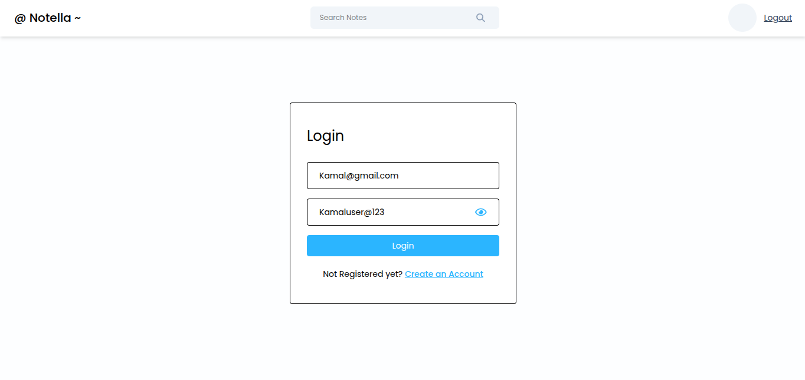
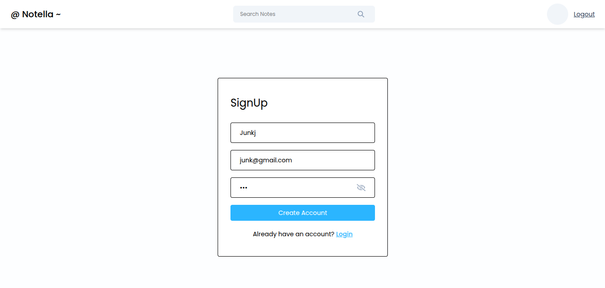
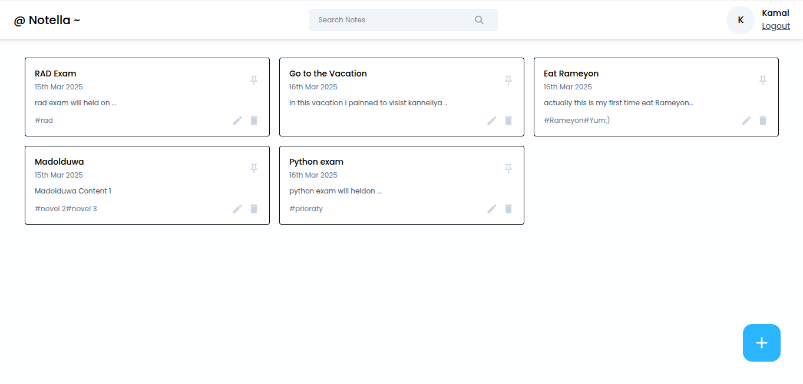
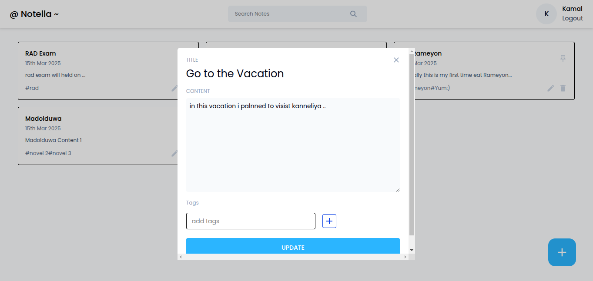

<h1 align="center">
    
</h1>

**Notella** is a full-stack notes application built with MongoDB, Express, React, and Node.js (MERN). It features user authentication (Sign Up & Login), adding/editing notes, pinning important notes, and searching for notes effortlessly. Stay organized with Notella!

## Frontend Technologies Used

- **React**: JavaScript library for building user interfaces.
- **Redux**: State management tool for React applications.
- **Tailwind CSS**: A utility-first CSS framework for styling.
- **React Router**: Routing library for single-page applications.
- **Axios**: Promise-based HTTP client for API communication.
- **Formik & Yup**: Libraries for handling forms and validation.

## Backend Technologies Used

- **Node.js**: JavaScript runtime environment.
- **Express.js**: Web framework for Node.js.
- **MongoDB & Mongoose**: NoSQL database with an object modeling tool.
- **JWT Authentication**: Secure user authentication.
- **Bcrypt.js**: Library for password hashing.
- **Cors**: Middleware for handling CORS policy.

## Project Setup

### Requirements
- Node.js (>=16.x)
- npm (>=8.x)
- MongoDB database

### Installation

1. Clone the repository:
   ```bash
   git clone https://github.com/sasobapriyanjana11/Notella-App-Frontend.git
   ```

2. Install dependencies:
   ```bash
   npm install
   ```

3. To run the development server:
   ```bash
   npm run dev
   ```

## Features

- User authentication (Sign Up & Login)
- Create, edit, and delete notes
- Pin important notes
- Search for notes efficiently
- Responsive UI with Tailwind CSS

## Dependencies

- **@reduxjs/toolkit**: State management with Redux.
- **axios**: HTTP client for making API requests.
- **react-router-dom**: Declarative routing for React apps.
- **formik & yup**: Form handling and validation.
- **bcryptjs**: Password hashing.
- **jsonwebtoken**: Secure authentication.
- **mongoose**: ODM for MongoDB.

## Screenshots

<div style="display: flex; flex-wrap: wrap; justify-content: center; gap: 16px; text-align: center;">
  <div style="flex: 1 1 calc(40% - 16px); max-width: calc(40% - 16px);">
    <h3>Login Page Notella</h3>
    
  </div>
     <div style="flex: 1 1 calc(40% - 16px); max-width: calc(40% - 16px);">
    <h3>Signup Page Notella</h3>
    
  </div>
  <div style="flex: 1 1 calc(40% - 16px); max-width: calc(40% - 16px);">
    <h3>Dashboard</h3>
    
  </div>
  <div style="flex: 1 1 calc(40% - 16px); max-width: calc(40% - 16px);">
    <h3>Edit Note</h3>
    
  </div>
</div>

### Backend Repository
The backend for this application is built using the MERN stack, and you can find the backend repository here:
[Backend Repository Link](https://github.com/sasobapriyanjana11/Notella-App-Backend)

## License
This project is licensed under the MIT License - see the LICENSE file for details.

